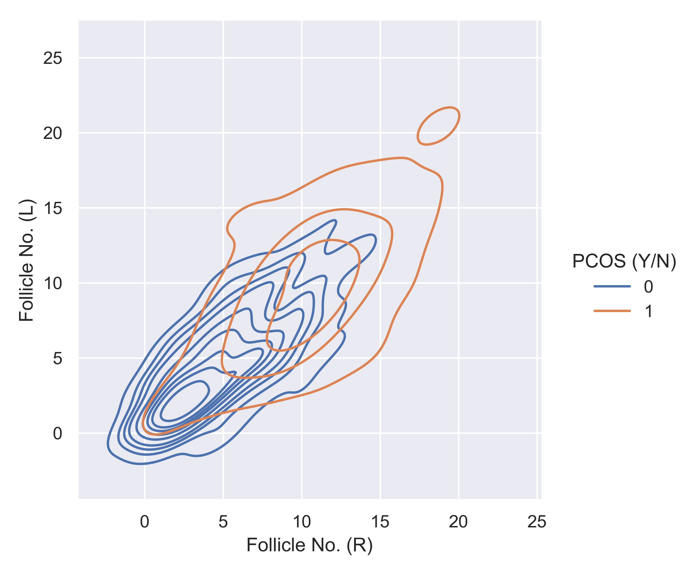
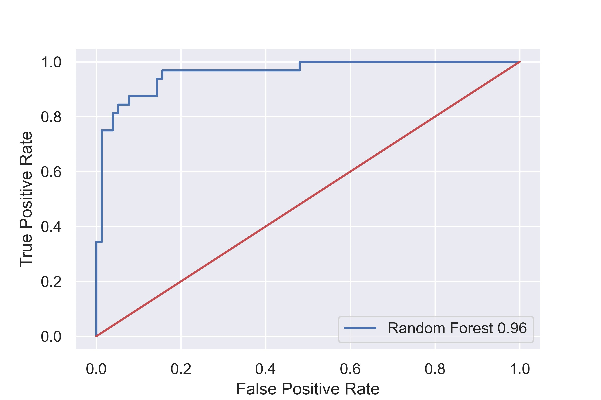

# PCOS-Prognostication-Application-using-Predictive-Analysis

The dataset used can be found [here](https://www.kaggle.com/datasets/prasoonkottarathil/polycystic-ovary-syndrome-pcos).

## Citation:

```
@article{kanvinde2022binary,
  title={Binary classification for high dimensional data using supervised non-parametric ensemble method},
  author={Kanvinde, Nandan and Gupta, Abhishek and Joshi, Raunak},
  journal={arXiv preprint arXiv:2202.07779},
  year={2022}
}
```
Medical Research data used for prognostication deals with binary classification problems in most of the cases. The endocrinological disorders have data available and it can be leveraged using Machine Learning. The dataset for Polycystic Ovary Syndrome is available, which is termed as an endocrinological disorder in women. Non-Parametric Supervised Ensemble machine learning methods can be used for prediction of the disorder in early stages. In this paper we present the Bootstrap Aggregation Supervised Ensemble Non-parametric method for prognostication that competes state-of-the-art performance with accuracy of over 92% along with in depth analysis of the data.

## Keywords 
* Bagging
* Ensemble Methods
* Random Forest

## Results

* KDE Plot

The below figure gives the Bivariate Kernel Density Estimation Plot for follicles with respect to the labels. The affected distribution is quite easily spot with such types of graphs. The good separation of points is seen.



                                          Figure 1: KDE Plot for Follicles with Labels

* Precision and Recall

The Precision and Recall are the type of metrics that give the notion of how the model performed instantly before any other metric. Precision and Recall have different variations known as Macro and Weighted Average. The macro requires every single label for computation with the unweighted average mean. The Weighted average on the other hand computes with number of true instances for every single label with average weighted mean. All the single labels are separately calculated for precision and recall.

o Table 1: Precision and Recall with Macro and Weighted Averages


| Variation | Precision | Recall |
| :---         |     :---:      |          ---: |
| Macro | 91% | 89% |
| Weighted | 92% | 92% |

o Table 2: Precision and Recall for individual labels


|Variation | Precision | Recall |
| :---         |     :---:      |          ---: |
|Label 0 | 93% | 96% |
|Label 1 | 90% | 81% |

* F1 Score

F1-Score is considered as harmonic average and represents the accuracy of the model. Even F1-Score has Macro and Weighted Averaging. The precision and recall are definitely the key components for the metric.

o Table 3: F1-Score with Macro and Weighted Averages


| Metric | Macro | Weighted |
| :---         |     :---:      |          ---: |
| F1-Score | 90% | 92% |


o Table 4: F1-Score for Individual Labels


|Metric | Label 0 | Label 1 |
| :---         |     :---:      |          ---: |
| F1-Score | 94% | 85% |

* 

The quality of the predictions made can be evaluated in a visual representation using Receiver Operating Characteristic Curve abbreviated as RoC Curve. The curve is formed using True Positive Rate and False Positive Rate. The threshold is a margin considered for the quality of predictions performed. The area that is covered above the margin is considered as Area Under Curve. Higher the curve, better is the algorithm.



                                                      Figure 2: RoC Curve with AuC
